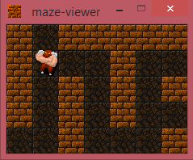

Maze Viewer
===========

A dead simple _viewer_ to help students with a class assignment.


Usage
-----

You can either invoke the maze-viewer.py script (or the generated .exe if you have it) without any arguments, in which case the sample maze and solution will be displayed, or with exactly two arguments. These should be the name of the file containing the maze (read your assignment description!) and the name of the file containing the steps for the solution (again, as described in the assignment):

```
python maze-viewer.py mazefile.txt stepsfile.txt
```

Credits
-------

The only reason this "project" has a README at all is because I'm using the excellent tiles from RLTiles (tiles from NetHack, Dungeon Crawl Stone Soup, etc), unmodified. So here are the credits:

Part of (or All) the graphic tiles used in this program is the Public domain roguelike tileset "RLTiles".

You can find the original tileset at: http://rltiles.sf.net
You can find Dungeon Crawl Stone Soup modified tilesets at: http://code.google.com/p/crawl-tiles/downloads/list
